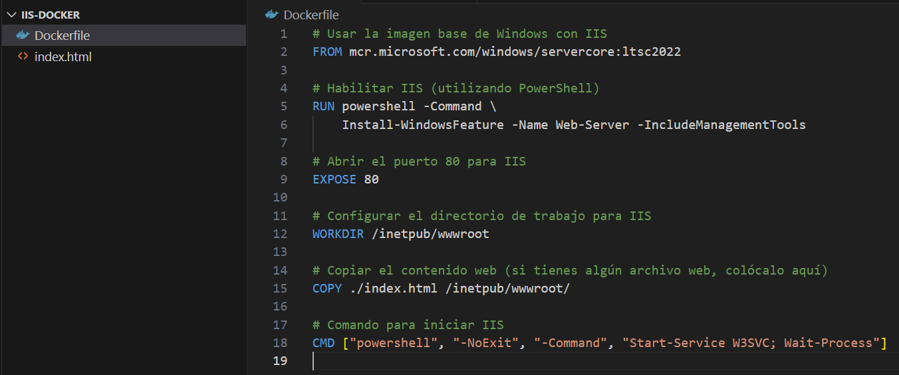
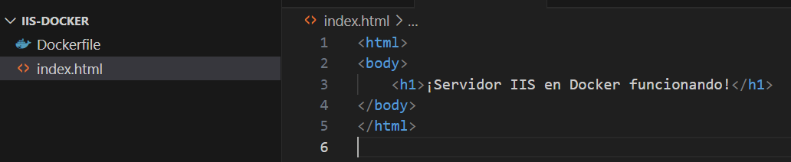
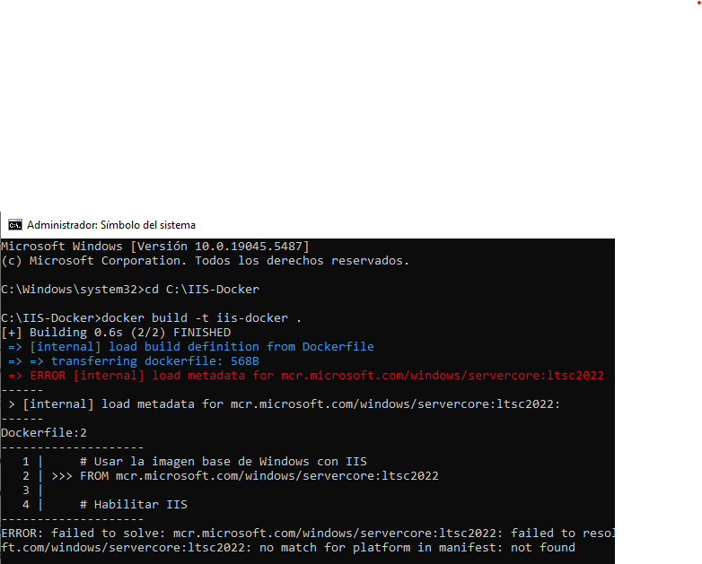

# Crear un servidor en docker para IIS

## Que es IIS?

Internet Information Services (IIS) es un servidor web desarrollado por Microsoft para sistemas operativos Windows. Permite hospedar sitios web, aplicaciones y servicios mediante protocolos como HTTP, HTTPS, FTP, FTPS y SMTP. Es ampliamente utilizado para aplicaciones basadas en tecnologías Microsoft, como ASP.NET y .NET Core.

## Pasos

Creacion de un archivo llamado "Dockerfile" con el siguiente contenido

Creacion de un archivo html llamado "index.html" con el que queramos  

Habiendo creado una carpeta llamda "IIS-Docker" nos dirigimos a esa carpeta desde la linea de comandos y ejecutamos el siguiente comando

**Para descargar la imagen de MySQL:**
~~~bash
docker build -t iis-docker .
~~~

Este error ocurre porque Docker no encuentra una versión compatible de servercore:ltsc2022 que puede deberse a varios factores como:
1. Docker está en modo Linux Containers en lugar de Windows Containers

2. La versión de Windows 10 que estoy utilizando puede no ser compatible con ltsc2022

No llegue a encontrar la forma de cambiar a Windows Containers en el Docker Desktop.
